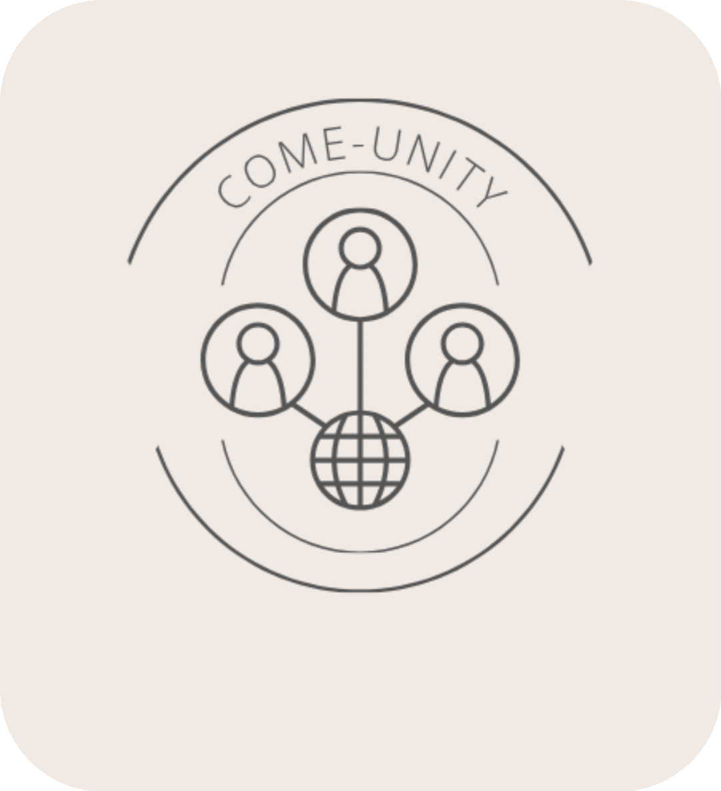

  

<h1 align="center">Come-Unity</h1>

**Come-Unity** is a web-based platform designed to simplify how community events are organized and attended. It bridges the gap between **event organizers**, **volunteers**, and **administrators** by providing a single, reliable hub for creating, discovering, and managing local events. The platform encourages collaboration by connecting people with causes that matter to them, ensuring events run smoothly and reach the right audiences. Through intuitive design and built-in tools for scheduling, communication, and reminders, **Come-Unity** reduces disorganization, and makes volunteering more accessible and rewarding for everyone involved.

##  Overview
Traditional methods of promoting community events—flyers, social media, and word-of-mouth—are often scattered and unreliable. This leads to miscommunication, unpredictable turnout, and disorganization.  
Come-Unity addresses these issues by centralizing event information and participation in one easy-to-use platform.

- **Organizers** can create, edit, and manage events.  
- **Volunteers** can browse upcoming events, RSVP, save events, and receive reminders.  
- **Admins** oversee event approvals and edits.

By streamlining communication, Come-Unity improves attendance, accountability, and community engagement.

##  Core Platform Features
- **User Authentication** – Secure registration and sign-in for volunteers and organizers.  
- **Event Management** – Create, edit, and delete events with admin approval.  
- **Smart Search & Filtering** – Quickly find events by date, location, or category.  
- **Volunteer Dashboard** – View upcoming, saved, and past events.  
- **Organizer Dashboard** – Manage created events and volunteer sign-ups.
- **Admin Dashboard** – Approve or deny new or edited events before publication.  
- **Notifications** – Email reminders and updates for all event participants.  
- **Bookmarking** – Save events of interest for later.

##  Highlights
- Secure account management and encrypted credentials.  
- Real-time RSVP updates and slot tracking.  
- Fast, accurate search and filtering system.  
- Clear, role-based user dashboards.  
- Responsive design.

##  Tech Stack (TBD)

- **Frontend:** React.js / HTML / CSS
- **Backend:** Node.js / Express.js
- **Database:** MongoDB or MySQL
- **Email Notifications:** Gmail API / Nodemailer 
- **Authentication:** JWT / bcrypt  

##  Contributors
Developed for **CSC 131 – Web Project**  

**Team 3:**  
- Aric Strohmeyer  
- Jonathan Moreno  
- Manmeet Kaur  
- Selena Garcia  
